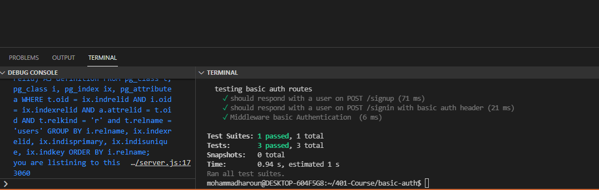
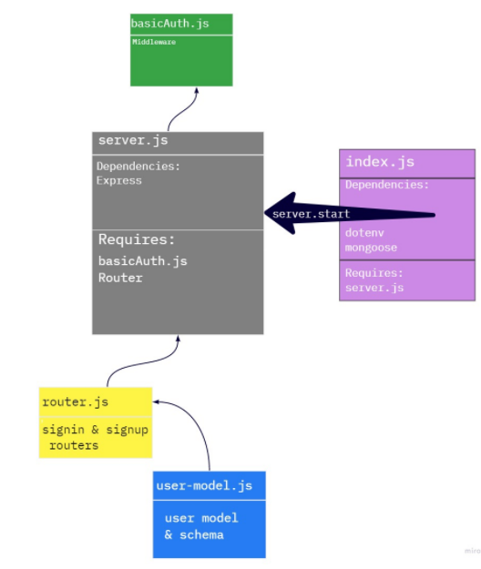

# basic-auth

## Author: Mohammad Haroun
just press on them 
for sign in and sign up routs please check them using postman or thunder because get route is not from the requirements
* [Deployment Link (Heroku for sign-in route) ](https://lab06-auth.herokuapp.com/signin)

* [Deployment Link (Heroku for sign-up route) ](https://lab06-auth.herokuapp.com/signup)
* [Test Report Link ](https://github.com/Mohammad-Haroun-97/basic-auth/actions)
* [Pull request Link ](https://github.com/Mohammad-Haroun-97/basic-auth/pull/4)
# Setup
* .env requirements
* PORT - Port Number
* npm i sequelize sequelize-cli pg sqlite3
# Running the app
npm start

# Tests
Unit Tests: npm run test
## locally test working

# Working Diagram 

